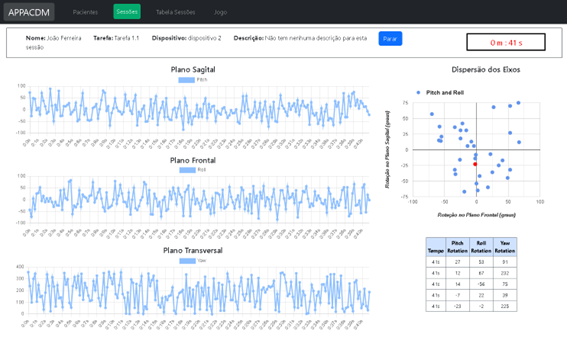
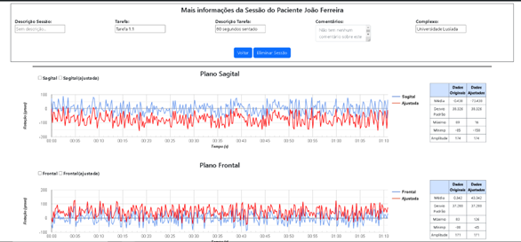
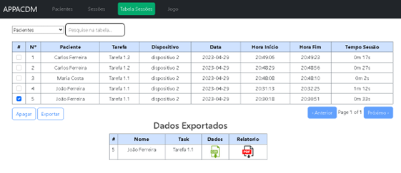

# ControloMonitorizacaoPostural

Currently **under development.**

Real-time visualization of a session where a patient performs a specific task, allowing for the analysis of the sagittal, transverse, and frontal planes of the patient through line charts and axis scatter plots.

Visualization of a past session

Table of conducted sessions for different patients, with the ability to export saved data from each session (in CSV format) as well as reports with associated graphs and statistical data (in PDF format).

cd Controlo-Monitorizacao-Postural

npm install         (install libraries)

npm start           (in cmd) 

npm run devicesimulator    (in new cmd, needs to both running at same time)
